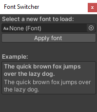
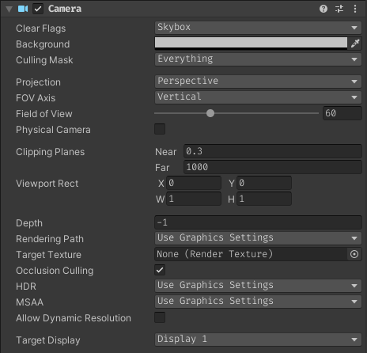
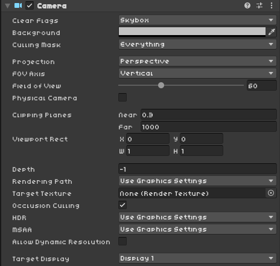
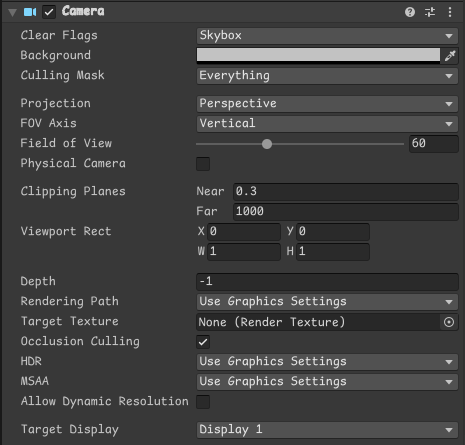

# Unity-Fontswitcher  
`Comic sans FINALLY!!!`

## First off...
#### What is this?
Unity by default supports two fonts:
[Inter](https://fonts.google.com/specimen/Inter)
and [Verdana](https://www.fonts.com/font/microsoft-corporation/verdana).

This project attempts to finally allow users to hotswap fonts at their will.

## This is what it looks like:

(this menu can be found at "Window/Switch Fonts")

## Examples
#### Consolas (Default Visual Studio font)

#### Fira Code (Popular open source coding font)

#### Kenney Mini (Popular game asset font)

#### Comic Mono (Monospaced obligatory font meme)

## Credit
This project uses some code based on [nukadelic's EditorFontSize.cs](https://gist.github.com/nukadelic/47474c7e5d4ee5909462e3b900f4cb82).

Fonts included in this project:

[Consolas](https://docs.microsoft.com/en-us/typography/font-list/consolas)

[Fira Code](https://github.com/tonsky/FiraCode)

[Kenney Mini](https://www.kenney.nl/assets/kenney-fonts)

[Comic Mono](https://github.com/dtinth/comic-mono-font)

## Future plans
Right now the user still has to select and apply their font of preference. Preferably some way must be found to automatically apply the user's selected font when the editor starts.

## Last but not least...
I hope you'll have fun playing with this. Peace out✌🏻!
